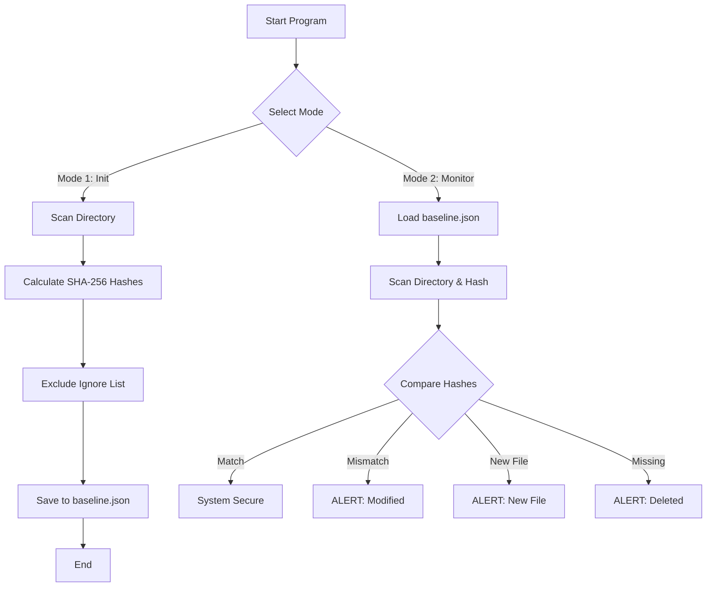

# Sentinel-FIM: File Integrity Monitor

A security tool developed in Python to monitor and detect unauthorized modifications to a file system. This project demonstrates core concepts of the **Integrity** pillar in the CIA Triad.

---

## 📑 Table of Contents

1. [Project Overview](#1-project-overview)
2. [Security Objectives](#2-security-objectives)
3. [Technical Architecture](#3-technical-architecture)
    * 3.1 [Hashing Strategy (SHA-256)](#31-hashing-strategy-sha-256)
    * 3.2 [Data Persistence](#32-data-persistence)
    * 3.3 [System-Specific Considerations (macOS)](#33-system-specific-considerations-macos)
4. [How It Works](#4-how-it-works)
    * 4.1 [Baseline Mode](#41-baseline-mode)
    * 4.2 [Monitor Mode](#42-monitor-mode)
5. [Logic Flowchart](#5-logic-flowchart)
6. [Challenges & Edge Cases](#6-challenges--edge-cases)
    * 6.1 [macOS System Files (.DS_Store)](#61-macos-system-files-ds_store)
    * 6.2 [Permission Handling](#62-permission-handling)
7. [Installation & Usage](#7-installation--usage)

---

## 1. Project Overview

**Sentinel-FIM** is a lightweight File Integrity Monitor (FIM) built in Python. This tool is designed to serve as a security utility that snapshots the "state" of a local directory and alerts the user to any unauthorized changes. 

In the context of **Product Security**, maintaining the integrity of source code and configuration files is paramount. This project demonstrates how automated auditing can detect the early stages of a system compromise, such as the injection of a backdoor or the modification of sensitive environment variables.

### The Problem
When a system is breached, attackers often modify existing files or drop malicious scripts into the file system. Without an automated integrity check, these changes can go unnoticed for months. Manual verification is impossible for large-scale projects, creating a need for a programmatic "source of truth."

### The Solution
Sentinel-FIM solves this by utilizing cryptographic hashing to create a unique "fingerprint" for every file within a target folder. By comparing these fingerprints over time, the tool can precisely identify:
* **Integrity Violations:** Existing files that have been modified (even by a single bit).
* **Unauthorized Additions:** New, unknown files that have appeared in the directory.
* **Data Loss:** Files that were present in the baseline but have since been deleted.

### Target Environment
While cross-platform by design, this tool was developed and tested on **macOS**, focusing on handling Unix-based file structures and system-specific edge cases (such as handling `.DS_Store` metadata files).

## 2. Security Objectives

The development of Sentinel-FIM is centered around the **CIA Triad** (Confidentiality, Integrity, and Availability), specifically focusing on the **Integrity** pillar. The project aims to achieve the following security goals:

### 🛡️ Data Integrity Verification
The primary objective is to ensure that "Data at Rest" has not been tampered with. By using cryptographic hashes, the tool provides a mathematical guarantee that a file's content is identical to its original "known-good" state.

### 🔍 Detection of "Living off the Land" Attacks
Modern attackers often use legitimate system tools or modify existing scripts to stay hidden. Sentinel-FIM is designed to detect these subtle changes in source code or configuration files that traditional antivirus or signature-based scanners might overlook.

### 📉 Reducing Mean Time to Detect (MTTD)
In security engineering, the goal is to discover a breach as quickly as possible. This tool automates the audit process, allowing for rapid detection of file-level changes that would take a human developer hours to find manually.

### 🛠️ Software Supply Chain Security
This project explores how developers can verify that their build environment remains "clean." By baseline-testing a project directory before a deployment, we ensure that no malicious artifacts or "extra" files have been injected into the software lifecycle.

## 3. Technical Architecture

Sentinel-FIM is built to be lightweight and dependency-free, relying on Python's standard library to ensure ease of deployment across different environments.

### 3.1 Core Components

* **Language:** Python 3.x
    * *Reasoning:* Selected for its robust standard library support, specifically for file system traversal and cryptographic operations, without needing external packages.
* **Hashing Algorithm:** SHA-256
    * *Reasoning:* Unlike MD5 or SHA-1, which have known collision vulnerabilities, SHA-256 (part of the SHA-2 family) offers a high degree of collision resistance while remaining performant for file integrity checks.
* **File System Handling:** `pathlib` Library
    * *Reasoning:* Used for object-oriented filesystem paths. It provides cross-platform compatibility, automatically handling the differences between macOS (Unix) forward slashes and Windows backslashes.

### 3.2 Data Flow & Storage

1.  **Baseline Generation:**
    The tool recursively scans the target directory using a Depth-First Search (DFS) approach. It computes the SHA-256 hash of every file and stores the `filepath:hash` key-value pairs in a local database (e.g., `baseline.txt` or `.json`).
    
2.  **Monitoring Logic:**
    During the monitoring phase, the tool rescans the directory and compares the current state against the stored baseline.
    * **Match:** File is unchanged.
    * **Mismatch:** File content has been modified (**Integrity Violation**).
    * **Key Missing in Baseline:** New file detected (**Intrusion Alert**).
    * **Key Missing in Current Scan:** File deleted (**Availability Issue**).

### 3.3 System-Specific Considerations (macOS)

* **Metadata Exclusion:** The architecture explicitly ignores OS-generated metadata files, specifically `.DS_Store`. These files change frequently based on user UI interactions (e.g., resizing a window) and would cause "False Positive" alerts if included in the integrity check.

## 4. How It Works

Sentinel-FIM operates in two distinct modes, mimicking the workflow of enterprise security tools like Tripwire or OSSEC in a simple educational version.

### 4.1 Baseline Mode (Initialization)
This mode is designed to be run when the system is in a **"Known Good State"** (e.g., immediately after a fresh install or a verified deployment).

1.  **Traversal:** The script uses `os.walk()` to crawl the target directory tree.
2.  **Fingerprinting:** For every file found (excluding those in the ignore list), the engine calculates a SHA-256 hash.
3.  **Serialization:** These path-hash pairs are stored in a dictionary and exported to `baseline.json`.
    * *Security Note:* This file acts as the "Golden Image." Any future deviation from this file is considered an anomaly.

### 4.2 Monitor Mode (Verification)
This mode is the auditing phase. It answers the question: *"Has anything changed since the baseline was created?"*

1.  **Re-Scanning:** The script performs a fresh scan of the directory, calculating new hashes for all current files.
2.  **Comparison Logic:** It compares the "Current State" against the loaded "Baseline."
3.  **Alerting:**
    * **[MODIFIED]:** The file exists in both states, but the hashes differ. (Critical: potential tampering).
    * **[NEW]:** A file exists now that was not in the baseline. (Warning: potential malware drop or unauthorized script).
    * **[DELETED]:** A file was in the baseline but is missing now. (Warning: potential data loss or cleanup attempt).

## 5. Logic Flowchart

The following diagram illustrates the control flow of the Sentinel-FIM application, detailing the decision process between Initialization and Monitoring.



## 6. Challenges & Edge Cases

During the development of Sentinel-FIM, several engineering challenges were addressed to ensure reliability and prevent false positives.

### 6.1 The "Recursion" Bug
**The Issue:** Early versions of the tool would save `baseline.json` inside the target directory. On the next scan, the tool would detect `baseline.json` as a "New File," creating a new hash for it, which would modify the file again, leading to an infinite loop of alerts.
**The Fix:** Added an internal **Ignore List** that explicitly excludes the tool's own configuration files (`baseline.json`, `sentinel.py`) from the hashing process.

### 6.2 OS-Specific Metadata (.DS_Store)
**The Issue:** On macOS, the Finder creates hidden `.DS_Store` files to store folder view settings (icon position, window size). These files change frequently based on user interaction, not security events.
**The Fix:** Implemented a filename filter in the directory crawler to ignore `.DS_Store`. This significantly reduced **False Positives**, ensuring alerts are only triggered by actual content changes.

### 6.3 Large File Handling (Memory Management)
**The Issue:** Attempting to hash a large file (e.g., 2GB ISO) by reading `f.read()` loads the entire file into RAM, which could crash the script on low-memory systems.
**The Fix:** Implemented **Chunked Reading**. The hashing engine reads files in 4KB (4096 byte) blocks. This allows the tool to process files of any size while maintaining a constant, low memory footprint.

## 7. Installation & Usage

Sentinel-FIM is designed to be plug-and-play. It relies on the Python Standard Library, meaning no external `pip install` commands are required.

### Prerequisites
* **Python 3.6+** (Required for `pathlib` support).
* A terminal or command prompt.

### Installation
1.  Clone the repository to your local machine:
    ```bash
    git clone [https://github.com/jaimeerans12/FileIntegrityMonitor.git](https://github.com/jaimeerans12/FileIntegrityMonitor.git)
    ```
2.  Navigate to the project directory:
    ```bash
    cd FileIntegrityMonitor
    ```

### How to Run
Execute the script directly using Python:
```bash
python3 sentinel.py
